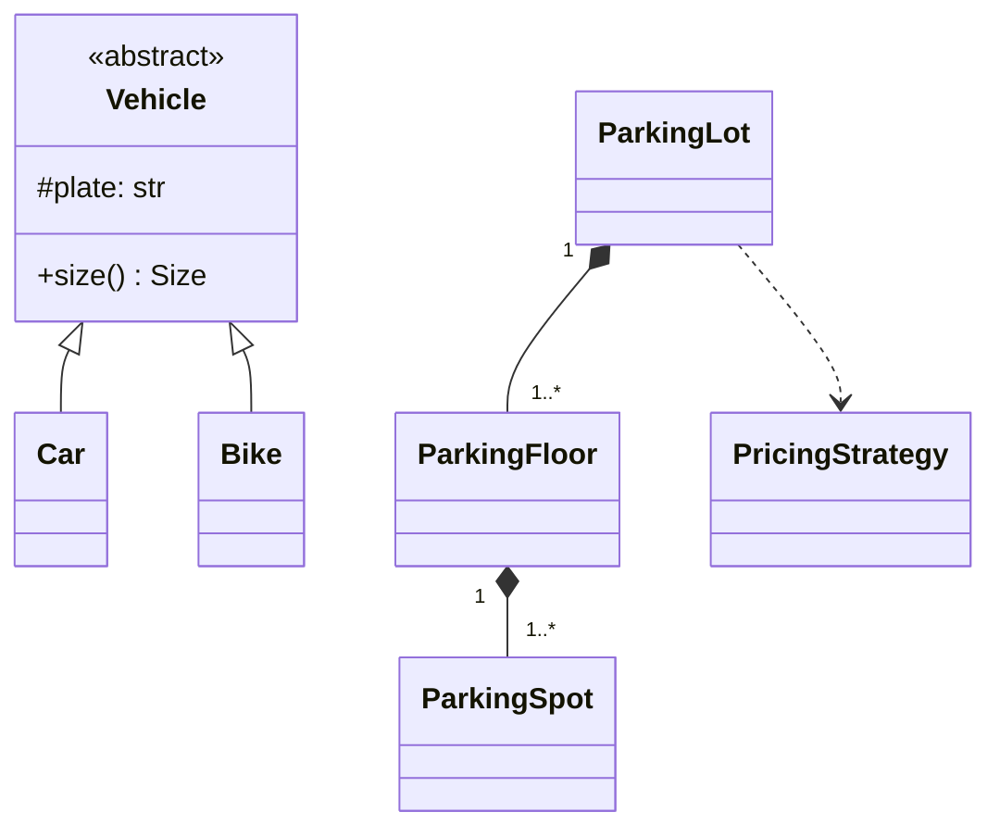

# 4. UML for Interviews

> **Verdict:** You need three diagrams and about six symbols. Everything else in the UML spec is noise you will never be asked for.

---

## What you actually need

| Diagram | Answers | Use it when |
|---|---|---|
| **Class diagram** | What are the pieces and how do they relate? | Always. This is 80% of LLD |
| **Sequence diagram** | What happens, in what order, when a user does X? | To prove your classes actually collaborate |
| **Use-case diagram** | Who can do what? | Only to confirm scope in the first 5 minutes |

That is the whole list. Nobody has ever been dinged for not drawing a
deployment diagram in an LLD round.

---

## Class diagram

### The box

```
┌─────────────────────────┐
│      BankAccount        │   ← class name
├─────────────────────────┤
│ - balance: float        │   ← fields
│ - owner: str            │
├─────────────────────────┤
│ + deposit(amount): void │   ← methods
│ + withdraw(amount): void│
│ + get_balance(): float  │
└─────────────────────────┘
```

Visibility markers — these four are the entire vocabulary:

| Symbol | Means |
|---|---|
| `+` | public |
| `-` | private |
| `#` | protected |
| `_underline_` | static |

Abstract classes and interfaces get a stereotype above the name:

```
┌─────────────────────────┐        ┌─────────────────────────┐
│    «interface»          │        │     «abstract»          │
│    PaymentMethod        │        │        Shape            │
├─────────────────────────┤        ├─────────────────────────┤
│ + pay(amount): Result   │        │ + area(): float         │
└─────────────────────────┘        └─────────────────────────┘
```

### The arrows — the part that gets marked

There are five relationships worth knowing, and the distinction between the
middle two is the one interviewers test.

```
A ──────────▷ B     Inheritance / implements   "A IS-A B"
                    (hollow triangle)

A ────────── B      Association                "A knows about B"
                    (plain line)

A ◇────────── B     Aggregation                "A HAS-A B, B survives A"
                    (hollow diamond)

A ◆────────── B     Composition                "A OWNS B, B dies with A"
                    (filled diamond)

A ─ ─ ─ ─ ─ ▷ B     Dependency                 "A uses B briefly"
                    (dashed)
```

**Aggregation vs composition — the one to get right:**

- **Aggregation (hollow ◇):** a `Department` has `Professor`s. Delete the
  department, the professors still exist and join another one.
- **Composition (filled ◆):** a `House` has `Room`s. Demolish the house, the
  rooms are gone. They have no life of their own.

Ask yourself: *if the container is destroyed, does the part still make sense?*
Yes → aggregation. No → composition.

### Multiplicity

Write the counts on the line ends:

```
Order ◆────────── OrderLine
      1        1..*

Student ────────── Course
       *          *
```

| Notation | Means |
|---|---|
| `1` | exactly one |
| `0..1` | zero or one (optional) |
| `*` or `0..*` | any number |
| `1..*` | at least one |

**Worth saying out loud:** "an Order must have at least one line, so 1..*" — it
shows you're thinking about invariants, not just drawing boxes.

### A full small example

Parking lot — the most-asked LLD warm-up:

```
                    ┌──────────────────┐
                    │   «abstract»     │
                    │     Vehicle      │
                    ├──────────────────┤
                    │ # plate: str     │
                    │ + size(): Size   │
                    └────────△─────────┘
                             │
          ┌──────────────────┼──────────────────┐
          │                  │                  │
   ┌──────┴─────┐     ┌──────┴─────┐     ┌──────┴─────┐
   │    Car     │     │    Bike    │     │   Truck    │
   └────────────┘     └────────────┘     └────────────┘


┌──────────────────┐                 ┌──────────────────┐
│   ParkingLot     │◆───────────────▶│   ParkingFloor   │
├──────────────────┤ 1          1..* ├──────────────────┤
│ - floors: list   │                 │ - spots: list    │
│ + park(v): Ticket│                 │ + find_spot(sz)  │
│ + unpark(t): Fee │                 └────────◆─────────┘
└──────────────────┘                          │ 1
         │                                    │ 1..*
         │ uses                      ┌────────┴─────────┐
         ▼                           │   ParkingSpot    │
┌──────────────────┐                 ├──────────────────┤
│  «interface»     │                 │ - size: Size     │
│  PricingStrategy │                 │ - occupied: bool │
├──────────────────┤                 └──────────────────┘
│ + fee(hours): $  │
└────────△─────────┘
         │
   ┌─────┴──────┐
   │ HourlyRate │
   └────────────┘
```

Read it back in words and you have narrated your design: *"A parking lot is
composed of floors, each floor owns its spots. Vehicles are an abstract type with
concrete subclasses. Pricing sits behind an interface so weekend rates are a new
class, not an edit."*

---

## Sequence diagram

Shows time flowing downward. Use it to prove one scenario end to end.

```
 :Customer      :ParkingLot     :ParkingFloor    :PricingStrategy
     │               │                │                 │
     │──park(car)───▶│                │                 │
     │               │──find_spot()──▶│                 │
     │               │◀───spot────────│                 │
     │               │                │                 │
     │               │ [spot is None] │                 │
     │◀──LotFullError│                │                 │
     │               │                │                 │
     │◀───ticket─────│                │                 │
     │               │                │                 │
     │──unpark(tkt)─▶│                │                 │
     │               │──────fee(hours)───────────────-─▶│
     │               │◀─────₹120───────────────────────│
     │◀───₹120───────│                                  │
```

Conventions worth using:
- Object names go as `:ClassName` (the colon means "an instance of").
- Solid arrow = call. Dashed arrow back = return.
- `[condition]` in square brackets marks an alternative path.

**When to draw one:** the interviewer asks "walk me through what happens when a
car arrives". Two minutes of this beats five minutes of talking.

---

## Use-case diagram

The simplest of the three. Use it in the first five minutes to lock down scope.

```
                    ┌───────────────────────────────┐
                    │        Parking System         │
                    │                               │
    ┌──┐            │   ( Park vehicle )            │
   ╭────╮           │                               │
   │    │──────────▶│   ( Unpark vehicle )          │
   ╰────╯           │                               │
  Customer          │   ( Pay fee )                 │
                    │                               │
    ┌──┐            │   ( Add floor )               │
   ╭────╮           │                               │
   │    │──────────▶│   ( View occupancy )          │
   ╰────╯           │                               │
   Admin            └───────────────────────────────┘
```

Its whole job is to make the interviewer say "yes, that's the scope" — or "no,
skip payments". Either answer saves you twenty minutes.

---

## Drawing it in the actual interview

**On a whiteboard / shared doc:**
- Boxes and lines. Skip fields on the first pass; add them once the structure is
  agreed.
- Write the arrow meaning in words if you're unsure of the symbol. `Order
  ──owns──▶ OrderLine` is never wrong. A wrong diamond is.

**In a text editor (very common in remote rounds):**

Plain ASCII works. Mermaid works too, and renders in GitHub, Notion and most
collaborative editors:

````markdown

````

Mermaid arrow syntax, since it's the only extra thing to memorise:

| Mermaid | Meaning |
|---|---|
| `<|--` | inheritance |
| `*--` | composition |
| `o--` | aggregation |
| `-->` | association |
| `..>` | dependency |

---

## Skim cheat sheet

- **Three diagrams total:** class (always), sequence (one scenario), use-case
  (scope check).
- **Visibility:** `+` public, `-` private, `#` protected.
- **Arrows:** `▷` is-a · `◆` owns (dies together) · `◇` has (survives) · `-->`
  knows · `..>` uses.
- **Multiplicity:** `1`, `0..1`, `*`, `1..*` — put it on the line.
- **Composition vs aggregation:** does the part survive the whole? Survives →
  hollow. Dies → filled.
- **If unsure of a symbol, label the line in English.** Never guess a diamond.

---

**Next:** [05 — The LLD Interview](05-the-lld-interview.md)
